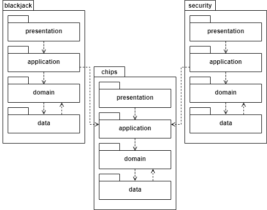

# HUland Casino Project
This project is part of an assignment for the
course Backend Programming 2 (BEP2) at the
Hogeschool Utrecht, University of Applied Sciences.


## Starter project
This starter project contains the following:

* A Maven-based setup with several 
third-party libraries and frameworks (see: `pom.xml`)
* A preconfigured Spring project
* A component for JWT-based 
user authentication and authorisation (`nl.hu.bep2.casino.security`)
* A component for basic 
chip functionality (`nl.hu.bep2.casino.chips`)
* A container-based development environment for PostgreSQL 
(see: `development/db/Dockerfile` and `docker-compose.yml`)

## Prerequisites
Although it is recommended to always use the latest stable version
of Java, this project requires a version of Java 11 or higher.
You can customize this in your compilation settings and `pom.xml`.

For [Maven](https://maven.apache.org/guides/getting-started/maven-in-five-minutes.html),
you can use your IDE, install it [globally](https://maven.apache.org/download.cgi), 
or use the supplied `mvnw` or `mvnw.cmd`.

## Project setup without Docker
If you are not using Docker for your database, you need 
[PostgreSQL 12](https://www.postgresql.org/) or higher to be installed.
For the application to work, we need the correct user and database
to be created. In PostgreSQL, create the user `bep2-huland-casino`
with the password `bep2-huland-casino` and the database `bep2-huland-casino`.

This can be done with the following SQL-queries (mind the quotation marks).

To create a new user (with the same username/password):
```postgresql
CREATE USER "bep2-huland-casino" WITH CREATEDB PASSWORD 'bep2-huland-casino';
```

To create the database and make the previously created user its owner:
```postgresql
CREATE DATABASE "bep2-huland-casino" OWNER "bep2-huland-casino";
```

> :warning: **Perform this task by executing the SQL query above (do not use a db tool)**  
>  
> When executing the raw query above Postgres will assume that the user is able to login.  
> Other DB tools may not have the same behaviour by default, which may cause issues logging in.

You can change these names if you like, but keep in mind
that you need to also change them in our application configuration
in `src/resources/application.properties`.

The database interaction is handled by Spring Data.
Database-specific implementation details are 
part of another course.


## Project setup with Docker
Although not supported on every system,
Development is easiest with [Docker](https://docs.docker.com/desktop/). 
If Docker is installed, 
you can start the database by executing
`docker-compose up` from the commandline 
(or `docker-compose start` to run it in the background), 
while the current directory is the root of this project.
Docker will then start a PostgreSQL image with
the configuration stated in the `docker-compose.yml`
and in `development/db`.

If something goes wrong starting docker-compose, and you
wish to rebuild your image, do so with `docker-compose up --build -V`.

This creates an admin user with the username and password `admin`
and `admin` and a user, password and database for the application,
all called `bep2-huland-casino`.


### Troubleshooting Docker
If you already have PostgreSQL running in the background
and you don't want to stop that process, 
you will have to change the port-binding from `15432:5432` 
to something else, for instance `25432:5432` in `docker-compose.yml`
and in `src/resources/application.properties`. Don't forget to 
change this in your development environment's database client as well.

If data does not seem to be persisted when restarting the
database, make sure Docker has a volume assigned to it.
Add the project's directory or parent directory 
under Docker's `Settings > Resources > File Sharing`.

If you cannot seem to connect to the database,
make sure Docker is allowed to use the host's network.

If all else fails, setup your database manually according 
to the steps explained above. Remember: it is OK to ask for help!

## Booting
First, make sure the database is set up, started and reachable.

Start the application via your IDE by running the `CasinoApplication`
class. Alternatively, run `mvn spring-boot:start`.


## Using Postman
The [Postman HTTP client](https://www.postman.com/product/rest-client/) 
can be used as an HTTP client for doing
requests to backend APIs like the one we are building.
Import, use and extend the collection in this repository
found in `hu-land-casino.postman_collection.json`.

### Automatic authentication and authorisation
In this collection, Postman has been configured
to automatically process the Authorization header from
the login response and add it as a collection variable.

The collection has been setup to authenticate any
request using this token.


## How do authentication and authorisation work?
The security component allows users to register and login.
Its general configuration is found in `nl.hu.bep2.casino.SecurityConfig`.
Authentication is configured in `...presentation.filter.JwtAuthenticationFilter`,
while Authorization is handled `...presentation.filter.JwtAuthorizationFilter`.

> :warning: The following is already handled by the imported Postman
> collection!

### Registration
Users can be registered via the API. 
Passwords are [hashed](https://auth0.com/blog/hashing-passwords-one-way-road-to-security/) 
using a password encoder ([bcrypt](https://en.wikipedia.org/wiki/Bcrypt)),
so that passwords are not stored in plain-text.

Registration can be done via a POST request to `/register`.
A body should be supplied with the following JSON 
(replace values to your liking):
```json
{
    "username": "admin",
    "password": "admin",
    "firstName": "Ad",
    "lastName": "Min"
}
```

### Login
The login is based on 
[JSON Web Tokens](https://jwt.io/introduction/), 
offering session-less authorisation.

Login by sending a POST request to `/login`, with
the following body (replace values to your liking):
```json
{
    "username": "admin",
    "password": "admin"
}
``` 

A `200 OK` is returned upon a successful login. The
JWT token is found as a Bearer token in the 
Authorization header of the response.

Copy this exact header in subsequent requests in order to remain logged in!
Note that the supplied Postman collection does this automatically!

## Component overview
Two components, *security* and *chips*, have already been created.
Students will have to make a new component, *blackjack*.
Keep in mind that the blackjack component will start with
an object-oriented domain layer. 
Other layers will be added as development (and learning) progresses.

It is a good idea to create a package structure that reflects
the application architecture.

